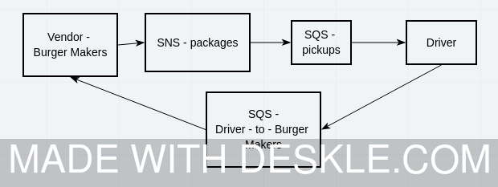
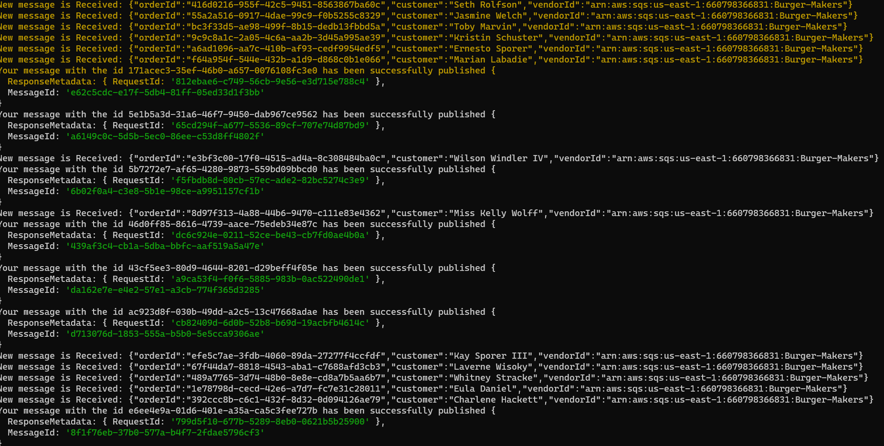
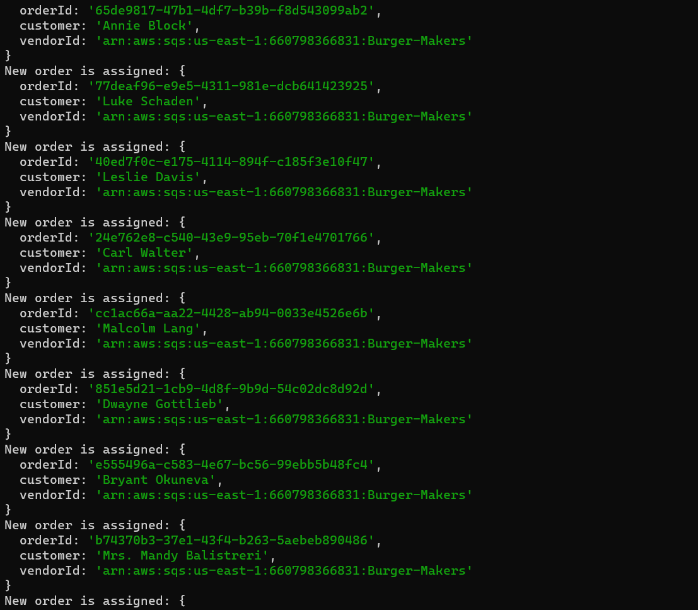

# LAB - Class 19

## Project: caps-cloud

### Author: Omar Ramadan

### Links and Resources

- [Pull Request][(http://xyz.com](https://github.com/401-repos/caps-cloud/pull/1))

### Setup

#### `.env` requirements

- `PORT` - Port Number
- `MONGODB_URI` - URL to the running mongo instance/db
- `AWS_REGION` - AWS region from AWS account
- `AWS_ACCESS_KEY_ID` - From AWS credintials
- `AWS_SECRET_ACCESS_KEY` - From AWS credintials
- `AWS_SESSION_TOKEN` - From AWS credintials
- `VENDOR_SQS_URL` - AWS SQS queue that you want ot send to
- `SNS_ARN` - The SNS URL that your application sends norifications to

#### How to initialize/run your application (where applicable)

- Create AWS SNS for the packages
- Create AWS SQS and subscribe to the SNS for pickups
- Create AWS SQS for vendor
- Add the .env file and include all dotenv variable
- Run vendor.js
- Run driver.js

#### UML

#### Proof of life Vendor

### Proof of life Driver

